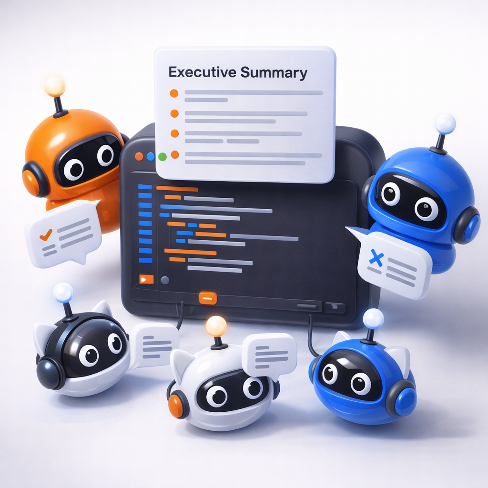

# Multi-Agent Code Reviewer

AI-powered parallel code review tool that orchestrates multiple specialized agents using the GitHub Copilot SDK for Java.



## Quick Start

```bash
mvn clean package
java --enable-preview -jar target/multi-agent-reviewer-1.0.0-SNAPSHOT.jar run --repo owner/repo --all
```

## Documentation

- English: [HOWTO_en.md](./HOWTO_en.md)
- 日本語: [HOWTO_ja.md](./HOWTO_ja.md)
- Release Notes (EN): [RELEASE_NOTES.md](./RELEASE_NOTES.md)
- ※日本語のリリースノートはありませんが、英語版の [RELEASE_NOTES.md](./RELEASE_NOTES.md) を参照してください。

### Doc Sync Note

`reviewer.copilot` settings (`cli-path`, `healthcheck-seconds`, `authcheck-seconds`, `start-timeout-seconds`) are documented in both the English and Japanese HOWTO files.
