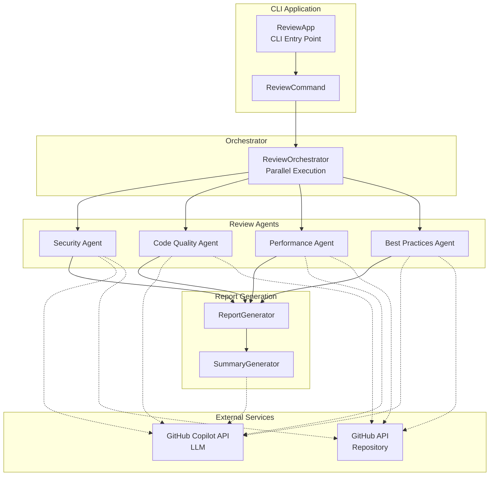

# Multi-Agent Code Reviewer

A parallel code review application using multiple AI agents with GitHub Copilot SDK for Java.


## Features

- **Parallel Multi-Agent Execution**: Simultaneous review from security, code quality, performance, and best practices perspectives
- **GitHub Repository / Local Directory Support**: Review source code from GitHub repositories or local directories
- **Custom Instructions**: Incorporate project-specific rules and guidelines into the review
- **Flexible Agent Definitions**: Define agents in GitHub Copilot format (.agent.md)
- **Agent Skill Support**: Define individual skills for agents to execute specific tasks
- **External Configuration Files**: Agent definitions can be swapped without rebuilding
- **LLM Model Selection**: Use different models for review, report generation, and summary generation
- **Structured Review Results**: Consistent format with Priority (Critical/High/Medium/Low)
- **Executive Summary Generation**: Management-facing report aggregating all review results
- **GraalVM Support**: Native binary generation via Native Image
- **Reasoning Model Support**: Automatic reasoning effort configuration for Claude Opus, o3, o4-mini, etc.

## Requirements

- **GraalVM 25.0.2** (Java 21)
- GitHub Copilot CLI 0.0.401 or later
- GitHub token (for repository access)

### Installing GraalVM

Using SDKMAN:

```bash
sdk install java 25.0.2-graal
sdk use java 25.0.2-graal

# Auto-switch in project directory
cd multi-agent-reviewer  # GraalVM is automatically selected via .sdkmanrc
```

## Installation

```bash
# Clone the repository
git clone https://github.com/your-org/multi-agent-reviewer.git
cd multi-agent-reviewer

# Build (JAR file)
mvn clean package

# Build native image (optional)
mvn clean package -Pnative
```

## Usage

### Basic Usage

```bash
# Run review with all agents (GitHub repository)
java -jar target/multi-agent-reviewer-1.0.0-SNAPSHOT.jar \
  run \
  --repo owner/repository \
  --all

# Review a local directory
java -jar target/multi-agent-reviewer-1.0.0-SNAPSHOT.jar \
  run \
  --local ./my-project \
  --all

# Run only specific agents
java -jar target/multi-agent-reviewer-1.0.0-SNAPSHOT.jar \
  run \
  --repo owner/repository \
  --agents security,performance

# Explicitly specify LLM models
java -jar target/multi-agent-reviewer-1.0.0-SNAPSHOT.jar \
  run \
  --repo owner/repository \
  --all \
  --review-model gpt-4.1 \
  --summary-model claude-sonnet-4

# Review with custom instructions
java -jar target/multi-agent-reviewer-1.0.0-SNAPSHOT.jar \
  run \
  --local ./my-project \
  --all \
  --instructions ./my-instructions.md

# List available agents
java -jar target/multi-agent-reviewer-1.0.0-SNAPSHOT.jar \
  list
```

### Run Options

| Option | Short | Description | Default |
|--------|-------|-------------|---------|
| `--repo` | `-r` | Target GitHub repository (exclusive with `--local`) | - |
| `--local` | `-l` | Target local directory (exclusive with `--repo`) | - |
| `--agents` | `-a` | Agents to run (comma-separated) | - |
| `--all` | - | Run all agents | false |
| `--output` | `-o` | Output directory | `./report` |
| `--agents-dir` | - | Additional agent definition directory | - |
| `--token` | - | GitHub token | `$GITHUB_TOKEN` |
| `--parallelism` | - | Number of parallel executions | 4 |
| `--no-summary` | - | Skip summary generation | false |
| `--model` | - | Default model for all stages | - |
| `--review-model` | - | Model for review | Agent config |
| `--report-model` | - | Model for report generation | review-model |
| `--summary-model` | - | Model for summary generation | claude-sonnet-4 |
| `--instructions` | - | Custom instruction file (can be specified multiple times) | - |
| `--no-instructions` | - | Disable automatic loading of custom instructions | false |
| `--help` | `-h` | Show help | - |
| `--version` | `-V` | Show version | - |
| `--verbose` | `-v` | Enable verbose logging (debug level) | - |

### List Subcommand

Displays a list of available agents. Additional directories can be specified with `--agents-dir`.

### Environment Variables

```bash
export GITHUB_TOKEN=your_github_token
```

### Local Directory Review

You can review source code from a local directory even when you cannot access a GitHub repository.

```bash
# Review a local project
java -jar target/multi-agent-reviewer-1.0.0-SNAPSHOT.jar \
  run \
  --local /path/to/project \
  --all
```

Supported file extensions:
- Java: `.java`
- Kotlin: `.kt`, `.kts`
- JavaScript/TypeScript: `.js`, `.ts`, `.jsx`, `.tsx`
- Python: `.py`
- Go: `.go`
- Ruby: `.rb`
- Others: `.c`, `.cpp`, `.h`, `.cs`, `.rs`, `.swift`, `.php`

### Custom Instructions

You can incorporate project-specific rules and guidelines into the review.

```bash
# Specify instruction files
java -jar target/multi-agent-reviewer-1.0.0-SNAPSHOT.jar \
  run \
  --local ./my-project \
  --all \
  --instructions ./coding-standards.md \
  --instructions ./security-guidelines.md

# Disable automatic loading
java -jar target/multi-agent-reviewer-1.0.0-SNAPSHOT.jar \
  run \
  --local ./my-project \
  --all \
  --no-instructions
```

#### Auto-detected Instruction Files

During local directory review, custom instructions are automatically loaded from the following paths (in order of priority):

1. `.github/copilot-instructions.md`
2. `.copilot/instructions.md`
3. `INSTRUCTIONS.md`
4. `.instructions.md`
5. `copilot-instructions.md`

### Output Example

```
./report/
├── security_260204.md
├── code-quality_260204.md
├── performance_260204.md
├── best-practices_260204.md
└── executive_summary_260204.md
```

## Configuration

Customize application behavior via `application.yml`.

```yaml
reviewer:
  execution:
    parallelism: 4              # Default parallel execution count
    orchestrator-timeout-minutes: 10  # Orchestrator timeout (minutes)
    agent-timeout-minutes: 10   # Agent timeout (minutes)
    skill-timeout-minutes: 10   # Skill timeout (minutes)
    summary-timeout-minutes: 10 # Summary timeout (minutes)
    gh-auth-timeout-seconds: 30 # GitHub auth timeout (seconds)
  mcp:
    github:
      type: http
      url: https://api.githubcopilot.com/mcp/
      tools:
        - "*"
      auth-header-name: Authorization
      auth-header-template: "Bearer {token}"
  models:
    review-model: claude-sonnet-4    # Model for review
    report-model: claude-sonnet-4    # Model for report generation
    summary-model: claude-sonnet-4   # Model for summary generation
    reasoning-effort: high           # Reasoning effort level (low/medium/high)
```

### Agent Directories

The following directories are automatically searched:

- `./agents/` - Default directory
- `./.github/agents/` - Alternative directory

Additional directories can be specified with the `--agents-dir` option.

### Agent Definition File (`.agent.md`)

Following the GitHub Copilot Custom Agent format, all section names are in English. Recognized sections:

| Section | Description |
|---------|-------------|
| `## Role` | Agent role / system prompt |
| `## Instruction` | Review instruction prompt |
| `## Focus Areas` | List of review focus areas |
| `## Output Format` | Output format specification |
| `## Skills` | Skill definitions |

In `Instruction`, you can use placeholders: `${repository}`, `${displayName}`, `${focusAreas}`.

```markdown
---
name: security
description: "Security Review"
model: claude-sonnet-4
---

# Security Review Agent

## Role

You are a security-focused code reviewer.
As an experienced security engineer, you identify vulnerabilities in the code.

## Instruction

Please perform a code review of the following GitHub repository.

**Target Repository**: ${repository}

Analyze all source code in the repository and identify issues from your specialty perspective (${displayName}).

Pay special attention to the following points:
${focusAreas}

## Focus Areas

- SQL Injection
- XSS Vulnerabilities
- Authentication/Authorization Issues

## Output Format

Please output the review results in the following format.
```

### Default Agents

| Agent | Description |
|-------|-------------|
| `security` | Security vulnerabilities, authentication/authorization, secrets |
| `code-quality` | Readability, complexity, SOLID principles, tests |
| `performance` | N+1 queries, memory leaks, algorithm efficiency |
| `best-practices` | Language/framework-specific best practices |

## Review Result Format

Each finding is output in the following format:

| Field | Description |
|-------|-------------|
| Title | Concise title describing the issue |
| Priority | Critical / High / Medium / Low |
| Summary | Description of the problem |
| Impact if Not Fixed | Risk if left unaddressed |
| Location | File path and line numbers |
| Recommended Action | Specific fix (including code examples) |
| Benefit | Improvement from the fix |

### Priority Criteria

- **Critical**: Security vulnerabilities, data loss, production outages. Immediate action required
- **High**: Serious bugs, performance issues. Prompt action needed
- **Medium**: Code quality issues, reduced maintainability. Address in planned manner
- **Low**: Style issues, minor improvement suggestions. Fix when time permits

## Agent Skill

Agents can have individual skills defined to execute specific tasks.

### skill Subcommand

```bash
# List available skills
java -jar target/multi-agent-reviewer-1.0.0-SNAPSHOT.jar \
  skill --list

# Execute a skill
java -jar target/multi-agent-reviewer-1.0.0-SNAPSHOT.jar \
  skill sql-injection-check \
  --param target=owner/repository

# Execute a skill with parameters
java -jar target/multi-agent-reviewer-1.0.0-SNAPSHOT.jar \
  skill secret-scan \
  --param repository=owner/repository \
  --model claude-sonnet-4
```

### skill Options

| Option | Short | Description | Default |
|--------|-------|-------------|---------|
| `--list` | - | List available skills | - |
| `--param` | `-p` | Parameter (key=value format) | - |
| `--token` | - | GitHub token | `$GITHUB_TOKEN` |
| `--model` | - | LLM model to use | claude-sonnet-4 |
| `--agents-dir` | - | Agent definitions directory | - |

### Skill Definition (`.agent.md` format)

Add a `## Skills` section to your agent definition file (`.agent.md`):

```markdown
## Skills

### sql-injection-check
- **Name**: SQL Injection Check
- **Description**: Checks for SQL injection vulnerabilities in specified file or repository
- **Parameters**:
  - `target` (required): Target file path or repository
- **Prompt**: |
  Analyze the following code for SQL injection vulnerabilities.
  
  **Target**: ${target}
  
  Look for these patterns:
  - SQL statements built with string concatenation
  - Non-parameterized queries
  - Direct embedding of user input in SQL statements

### secret-scan
- **Name**: Secret Scan
- **Description**: Detects hardcoded secrets in code
- **Parameters**:
  - `repository` (required): Target repository
- **Prompt**: |
  Analyze the following code for secret leakage.
  
  **Target Repository**: ${repository}
```

## GraalVM Native Image

To build as a native binary:

```bash
# Build native image
mvn clean package -Pnative

# Run
./target/review run --repo owner/repository --all
```

## Architecture



## Template Customization

Report and summary formats are externalized in template files.

### Template Directory

By default, templates in the `templates/` directory are used.

```
templates/
├── summary-system.md              # Summary generation system prompt
├── summary-prompt.md              # Summary generation user prompt
├── summary-result-entry.md        # Summary result entry (success)
├── summary-result-error-entry.md  # Summary result entry (failure)
├── default-output-format.md       # Default output format
├── report.md                      # Individual report template
├── report-link-entry.md           # Report link entry
├── executive-summary.md           # Executive summary template
├── fallback-summary.md            # Fallback summary template
├── fallback-agent-row.md          # Fallback table row
├── fallback-agent-success.md      # Fallback success detail
├── fallback-agent-failure.md      # Fallback failure detail
├── custom-instruction-section.md  # Custom instruction section
├── local-review-content.md        # Local review content
└── review-custom-instruction.md   # Review custom instruction
```

### Template Configuration

You can customize template paths in `application.yml`:

```yaml
reviewer:
  templates:
    directory: templates                    # Template directory
    summary-system-prompt: summary-system.md
    summary-user-prompt: summary-prompt.md
    default-output-format: default-output-format.md
    report: report.md
    executive-summary: executive-summary.md
    fallback-summary: fallback-summary.md
    summary-result-entry: summary-result-entry.md
    summary-result-error-entry: summary-result-error-entry.md
    fallback-agent-row: fallback-agent-row.md
    fallback-agent-success: fallback-agent-success.md
    fallback-agent-failure: fallback-agent-failure.md
    report-link-entry: report-link-entry.md
```

### Placeholders

Templates support `{{placeholder}}` format placeholders. See each template file for available placeholders.

## Project Structure

```
multi-agent-reviewer/
├── pom.xml                              # Maven configuration
├── .sdkmanrc                            # SDKMAN GraalVM configuration
├── agents/                              # Agent definitions (.agent.md format)
│   ├── security.agent.md
│   ├── code-quality.agent.md
│   ├── performance.agent.md
│   └── best-practices.agent.md
├── templates/                           # Template files
│   ├── summary-system.md
│   ├── summary-prompt.md
│   ├── report.md
│   └── ...
└── src/main/java/dev/logicojp/reviewer/
    ├── ReviewApp.java                   # CLI entry point
    ├── ReviewCommand.java               # review subcommand
    ├── ListAgentsCommand.java           # list subcommand
    ├── SkillCommand.java                # skill subcommand
    ├── agent/
    │   ├── AgentConfig.java             # Config model
    │   ├── AgentConfigLoader.java       # Config loader
    │   ├── AgentMarkdownParser.java     # .agent.md parser
    │   └── ReviewAgent.java             # Review agent
    ├── config/
    │   ├── ModelConfig.java             # LLM model config
    │   ├── ExecutionConfig.java         # Execution config
    │   ├── GithubMcpConfig.java         # GitHub MCP config
    │   └── TemplateConfig.java          # Template config
    ├── instruction/
    │   ├── CustomInstruction.java       # Custom instruction model
    │   ├── CustomInstructionLoader.java # Instruction loader
    │   └── InstructionSource.java       # Source type
    ├── orchestrator/
    │   └── ReviewOrchestrator.java      # Parallel execution control
    ├── report/
    │   ├── ReviewResult.java            # Result model
    │   ├── ReportGenerator.java         # Individual report generation
    │   └── SummaryGenerator.java        # Summary generation
    ├── service/
    │   ├── AgentService.java            # Agent management
    │   ├── CopilotService.java          # Copilot SDK integration
    │   ├── ReportService.java           # Report generation
    │   ├── ReviewService.java           # Review execution
    │   ├── SkillService.java            # Skill management
    │   └── TemplateService.java         # Template loading
    ├── skill/
    │   ├── SkillDefinition.java         # Skill definition model
    │   ├── SkillParameter.java          # Skill parameter model
    │   ├── SkillRegistry.java           # Skill registry
    │   ├── SkillExecutor.java           # Skill executor
    │   └── SkillResult.java             # Skill result model
    ├── target/
    │   ├── ReviewTarget.java            # Review target interface
    │   └── LocalFileProvider.java       # Local file collector
    └── util/
        └── FileExtensionUtils.java      # File extension utilities
```

## License

MIT License
