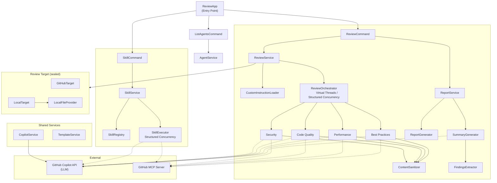

# Multi-Agent Code Reviewer

A parallel code review application using multiple AI agents with GitHub Copilot SDK for Java!


## Features

- **Parallel Multi-Agent Execution**: Simultaneous review from security, code quality, performance, and best practices perspectives
- **GitHub Repository / Local Directory Support**: Review source code from GitHub repositories or local directories
- **Custom Instructions**: Incorporate project-specific rules and guidelines into the review
- **Flexible Agent Definitions**: Define agents in GitHub Copilot format (.agent.md)
- **Agent Skill Support**: Define individual skills for agents to execute specific tasks
- **External Configuration Files**: Agent definitions can be swapped without rebuilding
- **Reusable Prompt Files**: Load GitHub Copilot format (.prompt.md) reusable prompts as supplementary instructions
- **LLM Model Selection**: Use different models for review, report generation, and summary generation
- **Structured Review Results**: Consistent format with Priority (Critical/High/Medium/Low)
- **Executive Summary Generation**: Management-facing report aggregating all review results
- **GraalVM Support**: Native binary generation via Native Image
- **Reasoning Model Support**: Automatic reasoning effort configuration for Claude Opus, o3, o4-mini, etc.
- **Content Sanitization**: Automatic removal of LLM preamble text and chain-of-thought leakage from review output
- **Default Model Externalization**: Configure the default model in `application.yml` (changeable without rebuild)

## Requirements

- **GraalVM 25.0.2** (Java 25)
- GitHub Copilot CLI 0.0.407 or later
- GitHub token (for repository access)

## Supply Chain Policy

This repository enforces dependency and build hygiene in both Maven and GitHub Actions.

- Maven validate/build fails when checksum verification fails for Central artifacts.
- SNAPSHOT dependencies/plugins are blocked by Maven Enforcer.
- PR dependency review fails on vulnerability severity `moderate` or higher.
- PR dependency review denies these licenses: `GPL-2.0`, `GPL-3.0`, `AGPL-3.0`, `LGPL-2.1`, `LGPL-3.0`.
- CI workflow runs `validate`, `compile`, and `test` as required checks.

Recommended branch protection required checks:

- `Supply Chain Guard`
- `Build and Test`
- `Dependency Review`

### Installing GraalVM

Using SDKMAN:

```bash
sdk install java 25.0.2-graal
sdk use java 25.0.2-graal

# Auto-switch in project directory
cd multi-agent-reviewer  # GraalVM is automatically selected via .sdkmanrc
```

## Installation

```bash
# Clone the repository
git clone https://github.com/your-org/multi-agent-reviewer.git
cd multi-agent-reviewer

# Build (JAR file)
mvn clean package

# Build native image (optional)
mvn clean package -Pnative
```

## Usage

> Note: This project uses Java preview features. Run the JVM JAR with `--enable-preview`.

### Basic Usage

```bash
# Run review with all agents (GitHub repository)
java --enable-preview -jar target/multi-agent-reviewer-1.0.0-SNAPSHOT.jar \
  run \
  --repo owner/repository \
  --all

# Review a local directory
java --enable-preview -jar target/multi-agent-reviewer-1.0.0-SNAPSHOT.jar \
  run \
  --local ./my-project \
  --all

# Run only specific agents
java --enable-preview -jar target/multi-agent-reviewer-1.0.0-SNAPSHOT.jar \
  run \
  --repo owner/repository \
  --agents security,performance

# Explicitly specify LLM models
java --enable-preview -jar target/multi-agent-reviewer-1.0.0-SNAPSHOT.jar \
  run \
  --repo owner/repository \
  --all \
  --review-model gpt-4.1 \
  --summary-model claude-sonnet-4

# Review with custom instructions
java --enable-preview -jar target/multi-agent-reviewer-1.0.0-SNAPSHOT.jar \
  run \
  --local ./my-project \
  --all \
  --instructions ./my-instructions.md

# List available agents
java --enable-preview -jar target/multi-agent-reviewer-1.0.0-SNAPSHOT.jar \
  list
```

### Run Options

| Option | Short | Description | Default |
|--------|-------|-------------|---------|
| `--repo` | `-r` | Target GitHub repository (exclusive with `--local`) | - |
| `--local` | `-l` | Target local directory (exclusive with `--repo`) | - |
| `--agents` | `-a` | Agents to run (comma-separated) | - |
| `--all` | - | Run all agents | false |
| `--output` | `-o` | Output base directory | `./reports` |
| `--agents-dir` | - | Additional agent definition directory | - |
| `--token` | - | GitHub token (`-` for stdin) | `$GITHUB_TOKEN` |
| `--parallelism` | - | Number of parallel executions | 4 |
| `--no-summary` | - | Skip summary generation | false |
| `--model` | - | Default model for all stages | - |
| `--review-model` | - | Model for review | Agent config |
| `--report-model` | - | Model for report generation | review-model |
| `--summary-model` | - | Model for summary generation | default-model |
| `--instructions` | - | Custom instruction file (can be specified multiple times) | - |
| `--no-instructions` | - | Disable automatic loading of custom instructions | false |
| `--no-prompts` | - | Disable loading `.github/prompts/*.prompt.md` | false |
| `--help` | `-h` | Show help | - |
| `--version` | `-V` | Show version | - |
| `--verbose` | `-v` | Enable verbose logging (debug level) | - |

### List Subcommand

Displays a list of available agents. Additional directories can be specified with `--agents-dir`.

### Environment Variables

| Variable | Description | Default |
|----------|-------------|--------|
| `GITHUB_TOKEN` | GitHub auth token | - |
| `COPILOT_CLI_PATH` | Path to the Copilot CLI binary | Auto-detected from PATH |
| `COPILOT_START_TIMEOUT_SECONDS` | Copilot client start timeout (seconds) | 60 |
| `COPILOT_CLI_HEALTHCHECK_SECONDS` | CLI health check timeout (seconds) | 10 |
| `COPILOT_CLI_AUTHCHECK_SECONDS` | CLI auth check timeout (seconds) | 15 |

```bash
export GITHUB_TOKEN=your_github_token
```

### Feature Flags (Structured Concurrency)

Enable structured concurrency globally or for skills only using env vars or JVM properties:

```bash
# Global structured concurrency
export REVIEWER_STRUCTURED_CONCURRENCY=true

# Skills-only structured concurrency
export REVIEWER_STRUCTURED_CONCURRENCY_SKILLS=true

# JVM properties (alternative)
java -Dreviewer.feature-flags.structured-concurrency=true -jar target/multi-agent-reviewer-1.0.0-SNAPSHOT.jar run --repo owner/repo --all
java -Dreviewer.feature-flags.structured-concurrency-skills=true -jar target/multi-agent-reviewer-1.0.0-SNAPSHOT.jar skill --list
```

### Local Directory Review

You can review source code from a local directory even when you cannot access a GitHub repository.

```bash
# Review a local project
java -jar target/multi-agent-reviewer-1.0.0-SNAPSHOT.jar \
  run \
  --local /path/to/project \
  --all
```

Supported file extensions:
- JVM: `.java`, `.kt`, `.kts`, `.groovy`, `.scala`, `.clj`
- Web: `.js`, `.jsx`, `.ts`, `.tsx`, `.mjs`, `.cjs`, `.vue`, `.svelte`
- Systems: `.c`, `.cpp`, `.cc`, `.cxx`, `.h`, `.hpp`, `.rs`, `.go`, `.zig`
- Scripting: `.py`, `.rb`, `.php`, `.pl`, `.pm`, `.lua`, `.r`
- Shell: `.sh`, `.bash`, `.zsh`, `.fish`, `.ps1`, `.psm1`
- .NET: `.cs`, `.fs`, `.vb`
- Mobile: `.swift`, `.m`, `.mm`
- Data/Config: `.sql`, `.graphql`, `.gql`, `.proto`, `.yaml`, `.yml`, `.json`, `.toml`, `.xml`, `.properties`
- Build: `.gradle`, `.cmake`, `.makefile`
- Docs: `.md`, `.rst`, `.adoc`

> **Note**: Files up to 256 KB each are collected, with a 2 MB total limit. Files that may contain sensitive information (`application-prod`, `.env`, `keystore`, etc.) are automatically excluded.

### Custom Instructions

You can incorporate project-specific rules and guidelines into the review.

```bash
# Specify instruction files
java -jar target/multi-agent-reviewer-1.0.0-SNAPSHOT.jar \
  run \
  --local ./my-project \
  --all \
  --instructions ./coding-standards.md \
  --instructions ./security-guidelines.md

# Disable automatic loading
java -jar target/multi-agent-reviewer-1.0.0-SNAPSHOT.jar \
  run \
  --local ./my-project \
  --all \
  --no-instructions
```

#### Auto-detected Instruction Files

During local directory review, custom instructions are automatically loaded from the following paths (in order of priority):

1. `.github/copilot-instructions.md`
2. `.copilot/instructions.md`
3. `copilot-instructions.md`
4. `INSTRUCTIONS.md`
5. `.instructions.md`
6. `.github/instructions/*.instructions.md` (GitHub Copilot per-scope instructions)
7. `.github/prompts/*.prompt.md` (GitHub Copilot reusable prompt files)

#### GitHub Copilot Per-scope Instructions

The `.github/instructions/*.instructions.md` format used by GitHub Copilot is supported.  
YAML frontmatter can specify `applyTo` (target file glob pattern) and `description`.

```markdown
---
applyTo: '**/*.java'
description: 'Java coding standards'
---
- Use UpperCamelCase for class names
- Write Javadoc for all public methods
- Prefer immutable objects where possible
```

Multiple instruction files can be placed in the `.github/instructions/` directory:

```
.github/
├── copilot-instructions.md          # Repository-wide instructions
├── instructions/
│   ├── java.instructions.md         # Java-specific rules
│   ├── typescript.instructions.md   # TypeScript-specific rules
│   └── security.instructions.md     # Security guidelines
└── prompts/
    ├── java-junit.prompt.md         # JUnit test generation prompt
    └── java-docs.prompt.md          # Javadoc generation prompt
```

#### GitHub Copilot Reusable Prompt Files

The `.github/prompts/*.prompt.md` format used by GitHub Copilot is supported.
Prompt files are injected into the agent system prompt as supplementary instructions.

YAML frontmatter can specify `description` and `agent` (target agent).

```markdown
---
description: 'JUnit 5 best practices'
agent: 'agent'
---
# JUnit 5 Best Practices
Your goal is to help write effective unit tests...
```

Use `--no-prompts` to disable loading prompt files.

### Output Example

Reports are generated under the output base directory in a subdirectory corresponding to the review target.

**GitHub repository** (`--repo owner/repository`):
```
./reports/
└── owner/
    └── repository/
        ├── security_2026-02-14.md
        ├── code-quality_2026-02-14.md
        ├── performance_2026-02-14.md
        ├── best-practices_2026-02-14.md
        └── executive_summary_2026-02-14.md
```

**Local directory** (`--local /path/to/my-project`):
```
./reports/
└── my-project/
    ├── security_2026-02-14.md
    ├── code-quality_2026-02-14.md
    ├── performance_2026-02-14.md
    ├── best-practices_2026-02-14.md
    └── executive_summary_2026-02-14.md
```

Use `-o` / `--output` to change the output base directory (default: `./reports`).

## Configuration

Customize application behavior via `application.yml`.

```yaml
reviewer:
  execution:
    parallelism: 4              # Default parallel execution count
    orchestrator-timeout-minutes: 45  # Orchestrator timeout (minutes)
    agent-timeout-minutes: 20   # Agent timeout (minutes)
    idle-timeout-minutes: 5     # Idle timeout (minutes) — auto-terminate when no events
    skill-timeout-minutes: 20   # Skill timeout (minutes)
    summary-timeout-minutes: 20 # Summary timeout (minutes)
    gh-auth-timeout-seconds: 30 # GitHub auth timeout (seconds)
    max-retries: 2              # Max retry count on review failure
  templates:
    directory: templates              # Template directory
    output-constraints: output-constraints.md  # Output constraints (CoT suppression, language)
  skills:
    filename: SKILL.md                    # Skill definition filename
    directory: .github/skills             # Skill definitions directory
  mcp:
    github:
      type: http
      url: https://api.githubcopilot.com/mcp/
      tools:
        - "*"
      auth-header-name: Authorization
      auth-header-template: "Bearer {token}"
  models:
    default-model: claude-sonnet-4.5  # Default for all models (changeable without rebuild)
    review-model: GPT-5.3-Codex      # Model for review
    report-model: claude-opus-4.6-fast  # Model for report generation
    summary-model: claude-sonnet-4.5 # Model for summary generation
    reasoning-effort: high           # Reasoning effort level (low/medium/high)
```

### External Configuration Override

When running as a fat JAR or Native Image, you can override the built-in `application.yml` without rebuilding.

**Place `application.yml` in the working directory:**

```bash
# Fat JAR
cp application.yml ./
java -jar multi-agent-code-reviewer.jar

# Native Image
cp application.yml ./
./multi-agent-code-reviewer
```

**Or specify an explicit path via system property:**

```bash
# Fat JAR
java -Dmicronaut.config.files=/path/to/application.yml -jar multi-agent-code-reviewer.jar

# Native Image
./multi-agent-code-reviewer -Dmicronaut.config.files=/path/to/application.yml
```

**Or override individual properties via environment variables:**

```bash
export REVIEWER_MODELS_DEFAULT_MODEL=gpt-4
export REVIEWER_EXECUTION_PARALLELISM=8
java -jar multi-agent-code-reviewer.jar
```

> **Note:** The external `application.yml` only needs to contain the properties you want to override — you do not need to copy the entire file.

Configuration is resolved in the following priority order (highest first):

1. CLI options (`--review-model`, `--parallelism`, etc.)
2. System properties (`-Dreviewer.models.default-model=...`)
3. Environment variables (`REVIEWER_MODELS_DEFAULT_MODEL=...`)
4. External `application.yml` (working directory or `-Dmicronaut.config.files`)
5. Built-in `application.yml` (inside the JAR / Native Image)
6. Hardcoded defaults in record constructors

### Model Configuration Priority

Models are resolved in the following priority order:

1. **Individual model settings** (`review-model`, `report-model`, `summary-model`) take highest priority
2. **Default model** (`default-model`) — fallback when no individual setting is specified
3. **Hardcoded constant** (`ModelConfig.DEFAULT_MODEL`) — final fallback when nothing is configured in YAML

### Retry Behavior

When an agent review fails due to timeout or empty response, it is automatically retried.

- **Timeout is per-attempt, not cumulative**: `agent-timeout-minutes` applies independently to each attempt. For example, with `agent-timeout-minutes: 20` and `max-retries: 2`, the agent will try up to 3 times (initial + 2 retries) × 20 minutes each = up to 60 minutes total
- **Returns immediately on success**: If any attempt succeeds, remaining retries are skipped
- **Set `max-retries: 0`** to disable retries
- Retried on: timeout (`TimeoutException`), empty response, SDK exceptions

### Agent Directories

The following directories are automatically searched:

- `./agents/` - Default directory
- `./.github/agents/` - Alternative directory

Additional directories can be specified with the `--agents-dir` option.

### Agent Definition File (`.agent.md`)

Following the GitHub Copilot Custom Agent format, all section names are in English. Recognized sections:

| Section | Description |
|---------|-------------|
| `## Role` | Agent role / system prompt |
| `## Instruction` | Review instruction prompt |
| `## Focus Areas` | List of review focus areas |
| `## Output Format` | Output format specification |

In `Instruction`, you can use placeholders: `${repository}`, `${displayName}`, `${focusAreas}`.

```markdown
---
name: security
description: "Security Review"
model: claude-sonnet-4
---

# Security Review Agent

## Role

You are a security-focused code reviewer.
As an experienced security engineer, you identify vulnerabilities in the code.

## Instruction

Please perform a code review of the following GitHub repository.

**Target Repository**: ${repository}

Analyze all source code in the repository and identify issues from your specialty perspective (${displayName}).

Pay special attention to the following points:
${focusAreas}

## Focus Areas

- SQL Injection
- XSS Vulnerabilities
- Authentication/Authorization Issues

## Output Format

Please output the review results in the following format.
```

### Default Agents

| Agent | Description |
|-------|-------------|
| `security` | Security vulnerabilities, authentication/authorization, secrets |
| `code-quality` | Readability, complexity, SOLID principles, tests |
| `performance` | N+1 queries, memory leaks, algorithm efficiency |
| `best-practices` | Language/framework-specific best practices |

## Review Result Format

Each finding is output in the following format:

| Field | Description |
|-------|-------------|
| Title | Concise title describing the issue |
| Priority | Critical / High / Medium / Low |
| Summary | Description of the problem |
| Impact if Not Fixed | Risk if left unaddressed |
| Location | File path and line numbers |
| Recommended Action | Specific fix (including code examples) |
| Benefit | Improvement from the fix |

### Priority Criteria

- **Critical**: Security vulnerabilities, data loss, production outages. Immediate action required
- **High**: Serious bugs, performance issues. Prompt action needed
- **Medium**: Code quality issues, reduced maintainability. Address in planned manner
- **Low**: Style issues, minor improvement suggestions. Fix when time permits

## Agent Skill

Agents can have individual skills defined to execute specific tasks.

### skill Subcommand

```bash
# List available skills
java -jar target/multi-agent-reviewer-1.0.0-SNAPSHOT.jar \
  skill --list

# Execute a skill
java -jar target/multi-agent-reviewer-1.0.0-SNAPSHOT.jar \
  skill sql-injection-check \
  --param target=owner/repository

# Execute a skill with parameters
java -jar target/multi-agent-reviewer-1.0.0-SNAPSHOT.jar \
  skill secret-scan \
  --param repository=owner/repository \
  --model claude-sonnet-4
```

### skill Options

| Option | Short | Description | Default |
|--------|-------|-------------|---------|
| `--list` | - | List available skills | - |
| `--param` | `-p` | Parameter (key=value format) | - |
| `--token` | - | GitHub token (`-` for stdin) | `$GITHUB_TOKEN` |
| `--model` | - | LLM model to use | default-model |
| `--agents-dir` | - | Agent definitions directory | - |

### Skill Definition (`SKILL.md` format)

Skills are defined as standalone `SKILL.md` files placed in `.github/skills/<skill-name>/` directories. Each skill is a separate directory containing a `SKILL.md` file with YAML frontmatter and a Markdown body.

```
.github/skills/
├── sql-injection-check/
│   └── SKILL.md
├── secret-scan/
│   └── SKILL.md
├── complexity-analysis/
│   └── SKILL.md
└── ...
```

#### SKILL.md Format

```markdown
---
name: secret-scan
description: Detects hardcoded secrets in code such as API keys, tokens, passwords, private keys, and cloud credentials.
metadata:
  agent: security
---

# Secret Scan

Analyze the following code for secret leakage.

**Target Repository**: ${repository}

Look for these patterns:
- API keys, tokens
- Passwords
- Private keys
- Database connection strings
- AWS/Azure/GCP credentials

Report discovered secrets and recommend proper management approaches.
```

| Field | Description |
|-------|-------------|
| `name` | Skill name (defaults to directory name if omitted) |
| `description` | Skill description |
| `metadata.agent` | Agent to bind this skill to (e.g. `security`, `code-quality`). If omitted, available to all agents |
| Body | The prompt template. Supports `${paramName}` placeholders substituted at runtime |

## GraalVM Native Image

To build as a native binary:

```bash
# Build native image
mvn clean package -Pnative

# Run
./target/review run --repo owner/repository --all
```

### Generating Reflection Configuration (First Build / After Dependency Updates)

The Copilot SDK internally uses Jackson Databind for JSON-RPC communication. Because GraalVM Native Image restricts reflection, reflection configuration must be registered in advance for the SDK's internal DTO classes.

If the configuration is missing, the Native Image binary will time out when communicating with the Copilot CLI (this does not occur with the FAT JAR). This happens because Jackson performs JSON serialization/deserialization via reflection, and in a Native Image environment, metadata for unregistered classes is inaccessible. Exceptions are silently caught inside the SDK, leaving `CompletableFuture` instances permanently incomplete.

Use the GraalVM **tracing agent** to automatically collect the required reflection information from an actual execution.

```bash
# 1. Build the FAT JAR first
mvn clean package -DskipTests

# 2. Run with the tracing agent to auto-generate reflection configuration
#    Use config-merge-dir to merge with existing configuration
java -agentlib:native-image-agent=config-merge-dir=src/main/resources/META-INF/native-image \
     -jar target/multi-agent-reviewer-1.0.0-SNAPSHOT.jar \
     run --repo owner/repository --all

# 3. Verify the generated configuration
ls src/main/resources/META-INF/native-image/
# reflect-config.json, resource-config.json, proxy-config.json, etc. are generated/updated

# 4. Rebuild as Native Image
mvn clean package -Pnative -DskipTests
```

> **Note**: Use `config-merge-dir` instead of `config-output-dir` to merge with existing configurations (e.g., Logback) rather than overwriting them. Also, run all agents (security, performance, etc.) to exercise all code paths and generate complete configuration.

> **Tip**: Re-run the tracing agent whenever you update dependencies such as the Copilot SDK or Jackson.

## Architecture



## Template Customization

Report and summary formats are externalized in template files.

### Template Directory

By default, templates in the `templates/` directory are used.

```
templates/
├── summary-system.md              # Summary generation system prompt
├── summary-prompt.md              # Summary generation user prompt
├── summary-result-entry.md        # Summary result entry (success)
├── summary-result-error-entry.md  # Summary result entry (failure)
├── default-output-format.md       # Default output format
├── output-constraints.md          # Output constraints (CoT suppression, language)
├── report.md                      # Individual report template
├── report-link-entry.md           # Report link entry
├── executive-summary.md           # Executive summary template
├── fallback-summary.md            # Fallback summary template
├── fallback-agent-row.md          # Fallback table row
├── fallback-agent-success.md      # Fallback success detail
├── fallback-agent-failure.md      # Fallback failure detail
├── local-review-content.md        # Local review content
├── custom-instruction-section.md  # Custom instruction section
└── review-custom-instruction.md   # Review custom instruction
```

### Template Configuration

You can customize template paths in `application.yml`:

```yaml
reviewer:
  templates:
    directory: templates                    # Template directory
    summary-system-prompt: summary-system.md
    summary-user-prompt: summary-prompt.md
    default-output-format: default-output-format.md
    output-constraints: output-constraints.md  # Output constraints (CoT suppression, language)
    report: report.md
    executive-summary: executive-summary.md
    fallback-summary: fallback-summary.md
    local-review-content: local-review-content.md
    summary-result-entry: summary-result-entry.md
    summary-result-error-entry: summary-result-error-entry.md
    fallback-agent-row: fallback-agent-row.md
    fallback-agent-success: fallback-agent-success.md
    fallback-agent-failure: fallback-agent-failure.md
    report-link-entry: report-link-entry.md
```

### Placeholders

Templates support `{{placeholder}}` format placeholders. See each template file for available placeholders.

## Project Structure

```
multi-agent-reviewer/
├── pom.xml                              # Maven configuration
├── .sdkmanrc                            # SDKMAN GraalVM configuration
├── .github/
│   └── skills/                          # Skill definitions (SKILL.md format)
│       ├── sql-injection-check/
│       ├── secret-scan/
│       └── ...
├── agents/                              # Agent definitions (.agent.md format)
│   ├── security.agent.md
│   ├── code-quality.agent.md
│   ├── performance.agent.md
│   └── best-practices.agent.md
├── templates/                           # Template files
│   ├── summary-system.md
│   ├── summary-prompt.md
│   ├── report.md
│   └── ...
└── src/main/java/dev/logicojp/reviewer/
    ├── ReviewApp.java                   # CLI entry point
    ├── ReviewCommand.java               # review subcommand
    ├── ListAgentsCommand.java           # list subcommand
    ├── SkillCommand.java                # skill subcommand
    ├── agent/
    │   ├── AgentConfig.java             # Config model
    │   ├── AgentConfigLoader.java       # Config loader
    │   ├── AgentMarkdownParser.java     # .agent.md parser
    │   ├── ReviewAgent.java             # Review agent
    │   └── ReviewContext.java           # Shared review context
    ├── cli/
    │   ├── CliParsing.java              # CLI option parsing
    │   ├── CliUsage.java                # Help / usage display
    │   ├── CliValidationException.java  # CLI input validation exception
    │   └── ExitCodes.java               # Exit code constants
    ├── config/
    │   ├── ModelConfig.java             # LLM model config
    │   ├── ExecutionConfig.java         # Execution config
    │   ├── GithubMcpConfig.java         # GitHub MCP config
    │   ├── SkillConfig.java             # Skill config
    │   └── TemplateConfig.java          # Template config
    ├── instruction/
    │   ├── CustomInstruction.java       # Custom instruction model
    │   ├── CustomInstructionLoader.java # Instruction loader
    │   ├── InstructionSource.java       # Source type
    │   └── PromptLoader.java            # Prompt file loader
    ├── orchestrator/
    │   ├── ReviewOrchestrator.java      # Parallel execution control
    │   └── ReviewOrchestratorFactory.java # Orchestrator factory
    ├── report/
    │   ├── ContentSanitizer.java        # LLM preamble / CoT removal
    │   ├── FindingsExtractor.java       # Findings extraction
    │   ├── ReviewResult.java            # Result model
    │   ├── ReportGenerator.java         # Individual report generation
    │   └── SummaryGenerator.java        # Summary generation
    ├── service/
    │   ├── AgentService.java            # Agent management
    │   ├── CopilotService.java          # Copilot SDK integration
    │   ├── ReportService.java           # Report generation
    │   ├── ReviewService.java           # Review execution
    │   ├── SkillService.java            # Skill management
    │   └── TemplateService.java         # Template loading
    ├── skill/
    │   ├── SkillDefinition.java         # Skill definition model
    │   ├── SkillMarkdownParser.java     # Skill markdown parser
    │   ├── SkillParameter.java          # Skill parameter model
    │   ├── SkillRegistry.java           # Skill registry
    │   ├── SkillExecutor.java           # Skill executor
    │   └── SkillResult.java             # Skill result model
    ├── target/
    │   ├── ReviewTarget.java            # Review target (sealed interface)
    │   └── LocalFileProvider.java       # Local file collector
    └── util/
        ├── FeatureFlags.java            # Feature flag resolution
        ├── FrontmatterParser.java       # YAML frontmatter parser
        └── GitHubTokenResolver.java     # GitHub token resolution
```

## License

MIT License
