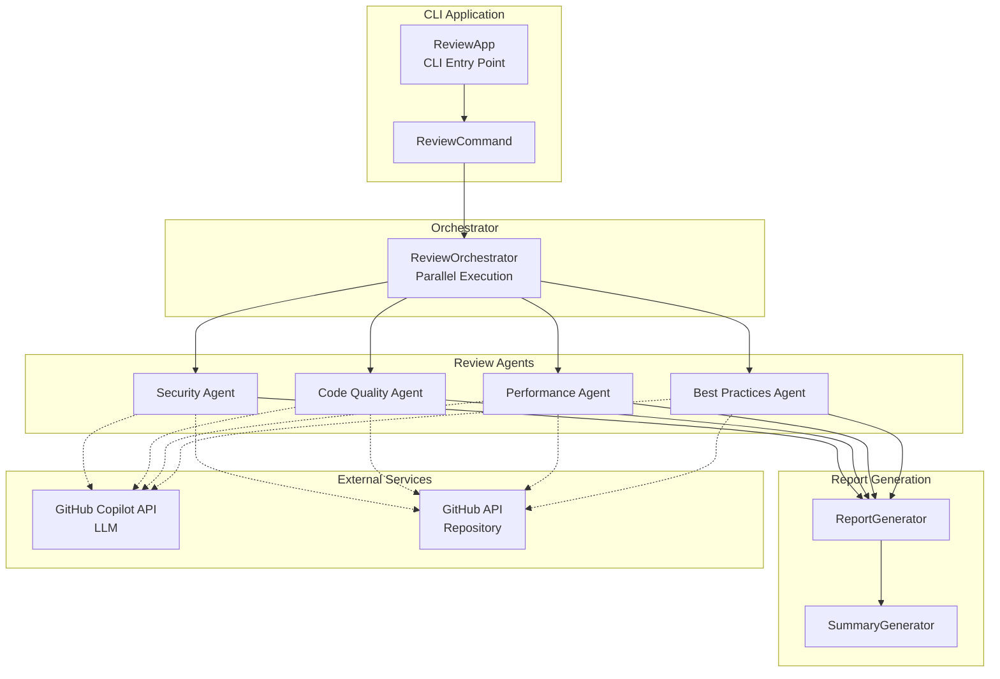

# Multi-Agent Code Reviewer

GitHub Copilot SDK for Java を使用した、複数のAIエージェントによる並列コードレビューアプリケーションです。


## 特徴

- **複数エージェント並列実行**: セキュリティ、コード品質、パフォーマンス、ベストプラクティスの各観点から同時レビュー
- **GitHubリポジトリ/ローカルディレクトリ対応**: GitHubリポジトリまたはローカルディレクトリのソースコードをレビュー
- **カスタムインストラクション**: プロジェクト固有のルールやガイドラインをレビューに反映
- **柔軟なエージェント定義**: GitHub Copilot形式 (.agent.md) でエージェントを定義
- **外部設定ファイル**: エージェント定義はビルド不要で差し替え可能
- **LLMモデル指定**: レビュー、レポート生成、サマリー生成で異なるモデルを使用可能
- **構造化されたレビュー結果**: Priority（Critical/High/Medium/Low）付きの一貫したフォーマット
- **エグゼクティブサマリー生成**: 全レビュー結果を集約した経営層向けレポート
- **GraalVM対応**: Native Image によるネイティブバイナリの生成が可能

## 要件

- **GraalVM 25.0.2** (Java 21)
- GitHub Copilot CLI 0.0.401 以上
- GitHub トークン（リポジトリアクセス用）

### GraalVM の インストール

SDKMAN を使用する場合:

```bash
sdk install java 25.0.2-graal
sdk use java 25.0.2-graal

# プロジェクトディレクトリで自動切り替え
cd multi-agent-reviewer  # .sdkmanrc により自動的にGraalVMが選択される
```

## インストール

```bash
# リポジトリをクローン
git clone https://github.com/your-org/multi-agent-reviewer.git
cd multi-agent-reviewer

# ビルド（JARファイル）
mvn clean package

# ネイティブイメージをビルド（オプション）
mvn clean package -Pnative
```

## 使い方

### 基本的な使用方法

```bash
# 全エージェントでレビュー実行（GitHubリポジトリ）
java -jar target/multi-agent-reviewer-1.0.0-SNAPSHOT.jar \
  run \
  --repo owner/repository \
  --all

# ローカルディレクトリのレビュー
java -jar target/multi-agent-reviewer-1.0.0-SNAPSHOT.jar \
  run \
  --local ./my-project \
  --all

# 特定のエージェントのみ実行
java -jar target/multi-agent-reviewer-1.0.0-SNAPSHOT.jar \
  run \
  --repo owner/repository \
  --agents security,performance

# LLMモデルを明示的に指定
java -jar target/multi-agent-reviewer-1.0.0-SNAPSHOT.jar \
  run \
  --repo owner/repository \
  --all \
  --review-model gpt-4.1 \
  --summary-model claude-sonnet-4

# カスタムインストラクションを指定してレビュー
java -jar target/multi-agent-reviewer-1.0.0-SNAPSHOT.jar \
  run \
  --local ./my-project \
  --all \
  --instructions ./my-instructions.md

# 利用可能なエージェント一覧
java -jar target/multi-agent-reviewer-1.0.0-SNAPSHOT.jar \
  list
```

### run オプション一覧

| オプション | 短縮形 | 説明 | デフォルト |
|-----------|--------|------|-----------|
| `--repo` | `-r` | 対象GitHubリポジトリ（`--local`と排他） | - |
| `--local` | `-l` | 対象ローカルディレクトリ（`--repo`と排他） | - |
| `--agents` | `-a` | 実行するエージェント（カンマ区切り） | - |
| `--all` | - | 全エージェント実行 | false |
| `--output` | `-o` | 出力ディレクトリ | `./report` |
| `--agents-dir` | - | 追加のエージェント定義ディレクトリ | - |
| `--token` | - | GitHub トークン | `$GITHUB_TOKEN` |
| `--parallelism` | - | 並列実行数 | 4 |
| `--no-summary` | - | サマリー生成をスキップ | false |
| `--model` | - | 全ステージのデフォルトモデル | - |
| `--review-model` | - | レビュー用モデル | エージェント設定 |
| `--report-model` | - | レポート生成用モデル | review-model |
| `--summary-model` | - | サマリー生成用モデル | claude-sonnet-4 |
| `--instructions` | - | カスタムインストラクションファイル（複数指定可） | - |
| `--no-instructions` | - | カスタムインストラクションの自動読込を無効化 | false |
| `--help` | `-h` | ヘルプ表示 | - |
| `--version` | `-V` | バージョン表示 | - |

### list サブコマンド

利用可能なエージェント一覧を表示します。`--agents-dir` で追加のディレクトリも指定可能です。

### 環境変数

```bash
export GITHUB_TOKEN=your_github_token
```

### ローカルディレクトリレビュー

GitHubリポジトリにアクセスできない環境でも、ローカルディレクトリのソースコードをレビューできます。

```bash
# ローカルプロジェクトをレビュー
java -jar target/multi-agent-reviewer-1.0.0-SNAPSHOT.jar \
  run \
  --local /path/to/project \
  --all
```

対応しているファイル拡張子:
- Java: `.java`
- Kotlin: `.kt`, `.kts`
- JavaScript/TypeScript: `.js`, `.ts`, `.jsx`, `.tsx`
- Python: `.py`
- Go: `.go`
- Ruby: `.rb`
- その他: `.c`, `.cpp`, `.h`, `.cs`, `.rs`, `.swift`, `.php`

### カスタムインストラクション

プロジェクト固有のルールやガイドラインをレビューに反映できます。

```bash
# インストラクションファイルを指定
java -jar target/multi-agent-reviewer-1.0.0-SNAPSHOT.jar \
  run \
  --local ./my-project \
  --all \
  --instructions ./coding-standards.md \
  --instructions ./security-guidelines.md

# 自動読込を無効化
java -jar target/multi-agent-reviewer-1.0.0-SNAPSHOT.jar \
  run \
  --local ./my-project \
  --all \
  --no-instructions
```

#### 自動検出されるインストラクションファイル

ローカルディレクトリレビュー時、以下のパスからカスタムインストラクションが自動的に読み込まれます（優先度順）:

1. `.github/copilot-instructions.md`
2. `.copilot/instructions.md`
3. `INSTRUCTIONS.md`
4. `.instructions.md`
5. `copilot-instructions.md`

### 出力例

```
./report/
├── security_260204.md
├── code-quality_260204.md
├── performance_260204.md
├── best-practices_260204.md
└── executive_summary_260204.md
```

## 設定ファイル

`application.yml` でアプリケーションの動作をカスタマイズできます。

```yaml
reviewer:
  orchestrator:
    default-parallelism: 4      # デフォルトの並列実行数
    timeout-minutes: 10         # レビュータイムアウト（分）
  mcp:
    github:
      type: http
      url: https://api.githubcopilot.com/mcp/
      tools:
        - "*"
      auth-header-name: Authorization
      auth-header-template: "Bearer ${token}"
  models:
    review-model: claude-sonnet-4    # レビュー用モデル
    report-model: claude-sonnet-4    # レポート生成用モデル
    summary-model: claude-sonnet-4   # サマリー生成用モデル
```

### エージェントディレクトリ

以下のディレクトリが自動的に検索されます:

- `./agents/` - デフォルトディレクトリ
- `./.github/agents/` - 代替ディレクトリ

`--agents-dir` オプションで追加のディレクトリを指定できます。

### エージェント定義ファイル (`.agent.md`)

`Review Prompt` では `${repository}`, `${displayName}`, `${focusAreas}` のプレースホルダーが利用できます。

```markdown
---
name: security
description: "セキュリティレビュー"
model: claude-sonnet-4
---

# セキュリティレビューエージェント

## System Prompt

あなたはセキュリティ専門のコードレビュアーです。
豊富な経験を持つセキュリティエンジニアとして、コードの脆弱性を特定します。

## Review Prompt

以下のGitHubリポジトリのコードレビューを実施してください。

**対象リポジトリ**: ${repository}

リポジトリ内のすべてのソースコードを分析し、あなたの専門分野（${displayName}）の観点から問題点を特定してください。

特に以下の点に注目してください：
${focusAreas}

## Focus Areas

- SQLインジェクション
- XSS脆弱性
- 認証・認可の問題

## Output Format

レビュー結果は必ず以下の形式で出力してください。
```

### デフォルトエージェント

| エージェント | 説明 |
|-------------|------|
| `security` | セキュリティ脆弱性、認証・認可、機密情報 |
| `code-quality` | 可読性、複雑度、SOLID原則、テスト |
| `performance` | N+1クエリ、メモリリーク、アルゴリズム効率 |
| `best-practices` | 言語・フレームワーク固有のベストプラクティス |

## レビュー結果フォーマット

各指摘事項は以下の形式で出力されます：

| 項目 | 説明 |
|------|------|
| タイトル | 問題を簡潔に表すタイトル |
| Priority | Critical / High / Medium / Low |
| 指摘の概要 | 何が問題かの説明 |
| 修正しない場合の影響 | 放置した場合のリスク |
| 該当箇所 | ファイルパスと行番号 |
| 推奨対応 | 具体的な修正方法（コード例含む） |
| 効果 | 修正による改善効果 |

### Priority の基準

- **Critical**: セキュリティ脆弱性、データ損失、本番障害。即時対応必須
- **High**: 重大なバグ、パフォーマンス問題。早急な対応が必要
- **Medium**: コード品質の問題、保守性の低下。計画的に対応
- **Low**: スタイルの問題、軽微な改善提案。時間があれば対応

## Agent Skill

エージェントには個別のスキルを定義し、特定のタスクを実行できます。

### skill サブコマンド

```bash
# 利用可能なスキル一覧
java -jar target/multi-agent-reviewer-1.0.0-SNAPSHOT.jar \
  skill --list

# スキルを実行
java -jar target/multi-agent-reviewer-1.0.0-SNAPSHOT.jar \
  skill sql-injection-check \
  --param target=owner/repository

# パラメータ付きでスキル実行
java -jar target/multi-agent-reviewer-1.0.0-SNAPSHOT.jar \
  skill secret-scan \
  --param repository=owner/repository \
  --model claude-sonnet-4
```

### skill オプション一覧

| オプション | 短縮形 | 説明 | デフォルト |
|-----------|--------|------|-----------|
| `--list` | - | 利用可能なスキル一覧を表示 | - |
| `--param` | `-p` | パラメータ（key=value形式） | - |
| `--token` | - | GitHub トークン | `$GITHUB_TOKEN` |
| `--model` | - | 使用するLLMモデル | claude-sonnet-4 |
| `--agents-dir` | - | エージェント定義ディレクトリ | - |

### スキル定義（.agent.md形式）

エージェント定義ファイル（`.agent.md`）内に `## Skills` セクションを追加します：

```markdown
## Skills

### sql-injection-check
- **Name**: SQLインジェクション検査
- **Description**: 指定されたファイルまたはリポジトリ内のSQLインジェクション脆弱性を検査します
- **Parameters**:
  - `target` (required): 検査対象のファイルパスまたはリポジトリ
- **Prompt**: |
  以下のコードをSQLインジェクション脆弱性の観点から分析してください。
  
  **対象**: ${target}
  
  特に以下のパターンを確認してください：
  - 文字列連結によるSQL文の構築
  - パラメータ化されていないクエリ
  - ユーザー入力の直接的なSQL文への埋め込み

### secret-scan
- **Name**: 機密情報スキャン
- **Description**: コード内のハードコードされた機密情報を検出します
- **Parameters**:
  - `repository` (required): 対象リポジトリ
- **Prompt**: |
  以下のコードを機密情報漏洩の観点から分析してください。
  
  **対象リポジトリ**: ${repository}
```

## GraalVM Native Image

ネイティブバイナリとしてビルドする場合:

```bash
# ネイティブイメージをビルド
mvn clean package -Pnative

# 実行
./target/review run --repo owner/repository --all
```

## アーキテクチャ



## テンプレートのカスタマイズ

レポートやサマリーのフォーマットは、テンプレートファイルで外部化されています。

### テンプレートディレクトリ

デフォルトでは `templates/` ディレクトリ内のテンプレートが使用されます。

```
templates/
├── summary-system.md          # サマリー生成システムプロンプト
├── summary-prompt.md          # サマリー生成ユーザープロンプト
├── default-output-format.md   # デフォルト出力フォーマット
├── report.md                  # 個別レポートテンプレート
├── executive-summary.md       # エグゼクティブサマリーテンプレート
├── fallback-summary.md        # フォールバックサマリーテンプレート
├── custom-instruction-section.md  # カスタムインストラクションセクション
├── local-review-content.md    # ローカルレビューコンテンツ
└── review-custom-instruction.md   # レビュー用カスタムインストラクション
```

### テンプレート設定

`application.yml` でテンプレートパスをカスタマイズできます:

```yaml
reviewer:
  templates:
    directory: templates                    # テンプレートディレクトリ
    summary-system-prompt: summary-system.md
    summary-user-prompt: summary-prompt.md
    default-output-format: default-output-format.md
    report: report.md
    executive-summary: executive-summary.md
    fallback-summary: fallback-summary.md
```

### プレースホルダー

テンプレート内では `{{placeholder}}` 形式のプレースホルダーが使用できます。各テンプレートで使用可能なプレースホルダーはテンプレートファイルを参照してください。

## プロジェクト構造

```
multi-agent-reviewer/
├── pom.xml                              # Maven設定
├── .sdkmanrc                            # SDKMAN GraalVM設定
├── agents/                              # エージェント定義（.agent.md形式）
│   ├── security.agent.md
│   ├── code-quality.agent.md
│   ├── performance.agent.md
│   └── best-practices.agent.md
├── templates/                           # テンプレートファイル
│   ├── summary-system.md
│   ├── summary-prompt.md
│   ├── report.md
│   └── ...
└── src/main/java/dev/logicojp/reviewer/
    ├── ReviewApp.java                   # CLIエントリポイント
    ├── ReviewCommand.java               # reviewサブコマンド
    ├── ListAgentsCommand.java           # listサブコマンド
    ├── SkillCommand.java                # skillサブコマンド
    ├── agent/
    │   ├── AgentConfig.java             # 設定モデル
    │   ├── AgentConfigLoader.java       # 設定読込
    │   ├── AgentMarkdownParser.java     # .agent.md パーサー
    │   └── ReviewAgent.java             # レビューエージェント
    ├── config/
    │   ├── ModelConfig.java             # LLMモデル設定
    │   ├── ExecutionConfig.java         # 実行設定
    │   ├── GithubMcpConfig.java         # GitHub MCP設定
    │   └── TemplateConfig.java          # テンプレート設定
    ├── instruction/
    │   ├── CustomInstruction.java       # カスタムインストラクションモデル
    │   ├── CustomInstructionLoader.java # インストラクション読込
    │   └── InstructionSource.java       # ソース種別
    ├── orchestrator/
    │   └── ReviewOrchestrator.java      # 並列実行制御
    ├── report/
    │   ├── ReviewResult.java            # 結果モデル
    │   ├── ReportGenerator.java         # 個別レポート生成
    │   └── SummaryGenerator.java        # サマリー生成
    ├── service/
    │   ├── AgentService.java            # エージェント管理
    │   ├── CopilotService.java          # Copilot SDK連携
    │   ├── ReportService.java           # レポート生成
    │   ├── ReviewService.java           # レビュー実行
    │   ├── SkillService.java            # スキル管理
    │   └── TemplateService.java         # テンプレート読込
    ├── skill/
    │   ├── SkillDefinition.java         # スキル定義モデル
    │   ├── SkillParameter.java          # スキルパラメータモデル
    │   ├── SkillRegistry.java           # スキルレジストリ
    │   ├── SkillExecutor.java           # スキル実行
    │   └── SkillResult.java             # スキル結果モデル
    ├── target/
    │   ├── ReviewTarget.java            # レビュー対象インターフェース
    │   └── LocalFileProvider.java       # ローカルファイル収集
    └── util/
        └── FileExtensionUtils.java      # ファイル拡張子ユーティリティ
```

## ライセンス

MIT License
