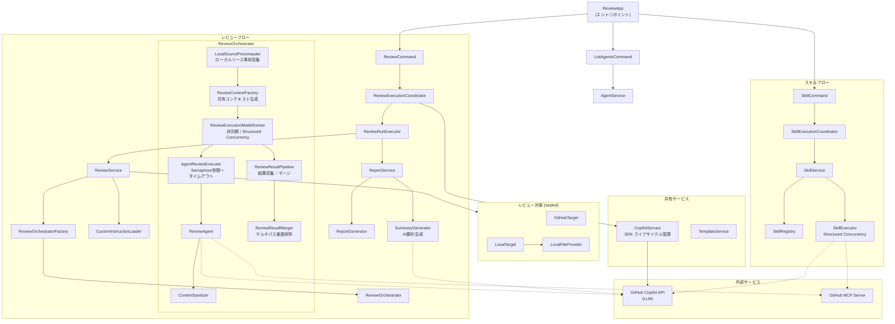

# Multi-Agent Code Reviewer

GitHub Copilot SDK for Java を使用した、複数のAIエージェントによる並列コードレビューアプリケーションです。


## 特徴

- **複数エージェント並列実行**: セキュリティ、コード品質、パフォーマンス、ベストプラクティスの各観点から同時レビュー
- **GitHubリポジトリ/ローカルディレクトリ対応**: GitHubリポジトリまたはローカルディレクトリのソースコードをレビュー
- **カスタムインストラクション**: プロジェクト固有のルールやガイドラインをレビューに反映
- **柔軟なエージェント定義**: GitHub Copilot形式 (.agent.md) でエージェントを定義
- **エージェントスキル対応**: エージェントに個別のスキルを定義し、特定のタスクを実行可能
- **外部設定ファイル**: エージェント定義はビルド不要で差し替え可能
- **プロンプトファイル対応**: GitHub Copilot 形式 (.prompt.md) の再利用可能プロンプトを補助インストラクションとして読込
- **LLMモデル指定**: レビュー、レポート生成、サマリー生成で異なるモデルを使用可能
- **構造化されたレビュー結果**: Priority（Critical/High/Medium/Low）付きの一貫したフォーマット
- **エグゼクティブサマリー生成**: 全レビュー結果を集約した経営層向けレポート
- **GraalVM対応**: Native Image によるネイティブバイナリの生成が可能
- **推論モデル対応**: Claude Opus、o3、o4-mini等の推論モデルに対するreasoning effortの自動設定
- **マルチパスレビュー**: 各エージェントが複数回レビューを実施し、結果をマージして網羅性を向上
- **コンテンツサニタイズ**: LLM出力からの不要な前置き文・思考過程の自動除去
- **デフォルトモデルの外部化**: `application.yml` でデフォルトモデルを設定可能（ビルド不要で変更可能）
- **インストラクションのサンドボックス化**: ユーザー提供指示を構造化境界付きで注入し、システム命令優先を明示
- **トークン寿命の最小化**: 実行境界でのみトークンを受け渡し、メモリ滞留時間を短縮
- **DI一貫性の強化**: `CopilotService` を no-arg なしのDIコンストラクタ運用へ統一

## 最新リメディエーション状況

- 最終リメディエーション作業（PR-1〜PR-5）は完了済みです。
- 最終チェックリスト: `reports/anishi1222/multi-agent-code-reviewer/final_remediation_checklist_2026-02-16.md`
- 最終サマリー: `reports/anishi1222/multi-agent-code-reviewer/final_remediation_summary_2026-02-17.md`
- README 日英対応ガイド: `reports/anishi1222/multi-agent-code-reviewer/readme_bilingual_alignment_2026-02-17.md`
- ドキュメント同期チェックリスト: `reports/anishi1222/multi-agent-code-reviewer/documentation_sync_checklist_2026-02-17.md`
- リリース詳細: `RELEASE_NOTES_ja.md` の `2026-02-17` セクション
- GitHub Release: https://github.com/anishi1222/multi-agent-code-reviewer-java/releases/tag/v2026.02.17-notes

## 要件

- **GraalVM 25.0.2** (Java 25)
- GitHub Copilot CLI 0.0.407 以上
- GitHub トークン（リポジトリアクセス用）

## サプライチェーンポリシー

このリポジトリでは、Maven と GitHub Actions の両方で依存関係とビルドの健全性を強制しています。

- Maven Central の成果物でチェックサム検証に失敗した場合、`validate/build` は失敗します。
- Maven Enforcer により `SNAPSHOT` 依存関係/プラグインを禁止しています。
- PR の Dependency Review は、脆弱性が `moderate` 以上で失敗します。
- PR の Dependency Review は、`GPL-2.0` / `GPL-3.0` / `AGPL-3.0` / `LGPL-2.1` / `LGPL-3.0` ライセンスを拒否します。
- CI ワークフローで `validate` / `compile` / `test` を必須チェックとして実行します。

推奨されるブランチ保護の Required checks:

- `Supply Chain Guard`
- `Build and Test`
- `Dependency Review`

### GraalVM の インストール

SDKMAN を使用する場合:

```bash
sdk install java 25.0.2-graal
sdk use java 25.0.2-graal

# プロジェクトディレクトリで自動切り替え
cd multi-agent-reviewer  # .sdkmanrc により自動的にGraalVMが選択される
```

## インストール

```bash
# リポジトリをクローン
git clone https://github.com/your-org/multi-agent-reviewer.git
cd multi-agent-reviewer

# ビルド（JARファイル）
mvn clean package

# ネイティブイメージをビルド（オプション）
mvn clean package -Pnative
```

## 使い方

> 注意: 本プロジェクトは Java のプレビュー機能を利用しています。JVM で実行する場合は `--enable-preview` を付けてください。

### 基本的な使用方法

```bash
# 全エージェントでレビュー実行（GitHubリポジトリ）
java --enable-preview -jar target/multi-agent-reviewer-1.0.0-SNAPSHOT.jar \
  run \
  --repo owner/repository \
  --all

# ローカルディレクトリのレビュー
java --enable-preview -jar target/multi-agent-reviewer-1.0.0-SNAPSHOT.jar \
  run \
  --local ./my-project \
  --all

# 特定のエージェントのみ実行
java --enable-preview -jar target/multi-agent-reviewer-1.0.0-SNAPSHOT.jar \
  run \
  --repo owner/repository \
  --agents security,performance

# LLMモデルを明示的に指定
java --enable-preview -jar target/multi-agent-reviewer-1.0.0-SNAPSHOT.jar \
  run \
  --repo owner/repository \
  --all \
  --review-model gpt-4.1 \
  --summary-model claude-sonnet-4

# カスタムインストラクションを指定してレビュー
java --enable-preview -jar target/multi-agent-reviewer-1.0.0-SNAPSHOT.jar \
  run \
  --local ./my-project \
  --all \
  --instructions ./my-instructions.md

# 利用可能なエージェント一覧
java --enable-preview -jar target/multi-agent-reviewer-1.0.0-SNAPSHOT.jar \
  list
```

### run オプション一覧

| オプション | 短縮形 | 説明 | デフォルト |
|-----------|--------|------|-----------|
| `--repo` | `-r` | 対象GitHubリポジトリ（`--local`と排他） | - |
| `--local` | `-l` | 対象ローカルディレクトリ（`--repo`と排他） | - |
| `--agents` | `-a` | 実行するエージェント（カンマ区切り） | - |
| `--all` | - | 全エージェント実行 | false |
| `--output` | `-o` | 出力ベースディレクトリ | `./reports` |
| `--agents-dir` | - | 追加のエージェント定義ディレクトリ | - |
| `--token` | - | GitHub トークン入力（`-` のみ許可、直接値指定は拒否） | `$GITHUB_TOKEN` |
| `--parallelism` | - | 並列実行数 | 4 |
| `--no-summary` | - | サマリー生成をスキップ | false |
| `--model` | - | 全ステージのデフォルトモデル | - |
| `--review-model` | - | レビュー用モデル | エージェント設定 |
| `--report-model` | - | レポート生成用モデル | review-model |
| `--summary-model` | - | サマリー生成用モデル | default-model |
| `--instructions` | - | カスタムインストラクションファイル（複数指定可） | - |
| `--no-instructions` | - | カスタムインストラクションの自動読込を無効化 | false |
| `--no-prompts` | - | `.github/prompts/*.prompt.md` の読込を無効化 | false |
| `--help` | `-h` | ヘルプ表示 | - |
| `--version` | `-V` | バージョン表示 | - |
| `--verbose` | `-v` | 詳細ログ出力（debugレベル） | - |

### list サブコマンド

利用可能なエージェント一覧を表示します。`--agents-dir` で追加のディレクトリも指定可能です。

### 環境変数

| 変数 | 説明 | デフォルト |
|------|------|--------|
| `GITHUB_TOKEN` | GitHub 認証トークン | - |
| `COPILOT_CLI_PATH` | Copilot CLI バイナリのパス | PATH から自動検出 |
| `COPILOT_START_TIMEOUT_SECONDS` | Copilot クライアント起動タイムアウト（秒） | 60 |
| `COPILOT_CLI_HEALTHCHECK_SECONDS` | CLI ヘルスチェック タイムアウト（秒） | 10 |
| `COPILOT_CLI_AUTHCHECK_SECONDS` | CLI 認証チェック タイムアウト（秒） | 15 |

```bash
export GITHUB_TOKEN=your_github_token
```

### 機能フラグ（Structured Concurrency）

structured concurrencyを有効化するには、環境変数またはJVMプロパティを使用します。

```bash
# 全体を対象にstructured concurrencyを有効化
export REVIEWER_STRUCTURED_CONCURRENCY=true

# スキル実行のみstructured concurrencyを有効化
export REVIEWER_STRUCTURED_CONCURRENCY_SKILLS=true

# JVMプロパティ（代替）
java -Dreviewer.feature-flags.structured-concurrency=true -jar target/multi-agent-reviewer-1.0.0-SNAPSHOT.jar run --repo owner/repo --all
java -Dreviewer.feature-flags.structured-concurrency-skills=true -jar target/multi-agent-reviewer-1.0.0-SNAPSHOT.jar skill --list
```

### ローカルディレクトリレビュー

GitHubリポジトリにアクセスできない環境でも、ローカルディレクトリのソースコードをレビューできます。

```bash
# ローカルプロジェクトをレビュー
java -jar target/multi-agent-reviewer-1.0.0-SNAPSHOT.jar \
  run \
  --local /path/to/project \
  --all
```

対応しているファイル拡張子:
- JVM: `.java`, `.kt`, `.kts`, `.groovy`, `.scala`, `.clj`
- Web: `.js`, `.jsx`, `.ts`, `.tsx`, `.mjs`, `.cjs`, `.vue`, `.svelte`
- システム言語: `.c`, `.cpp`, `.cc`, `.cxx`, `.h`, `.hpp`, `.rs`, `.go`, `.zig`
- スクリプト: `.py`, `.rb`, `.php`, `.pl`, `.pm`, `.lua`, `.r`
- シェル: `.sh`, `.bash`, `.zsh`, `.fish`, `.ps1`, `.psm1`
- .NET: `.cs`, `.fs`, `.vb`
- モバイル: `.swift`, `.m`, `.mm`
- データ/設定: `.sql`, `.graphql`, `.gql`, `.proto`, `.yaml`, `.yml`, `.json`, `.toml`, `.xml`, `.properties`
- ビルド: `.gradle`, `.cmake`, `.makefile`
- ドキュメント: `.md`, `.rst`, `.adoc`

> **注意**: 1ファイルあたり最大256KB、合計最大2MBまで収集されます。機密情報を含む可能性のあるファイル（`application-prod`、`.env`、`keystore`等）は自動的に除外されます。

### カスタムインストラクション

プロジェクト固有のルールやガイドラインをレビューに反映できます。

```bash
# インストラクションファイルを指定
java -jar target/multi-agent-reviewer-1.0.0-SNAPSHOT.jar \
  run \
  --local ./my-project \
  --all \
  --instructions ./coding-standards.md \
  --instructions ./security-guidelines.md

# 自動読込を無効化
java -jar target/multi-agent-reviewer-1.0.0-SNAPSHOT.jar \
  run \
  --local ./my-project \
  --all \
  --no-instructions
```

#### 自動検出されるインストラクションファイル

ローカルディレクトリレビュー時、以下のパスからカスタムインストラクションが自動的に読み込まれます（優先度順）:

1. `.github/copilot-instructions.md`
2. `.copilot/instructions.md`
3. `copilot-instructions.md`
4. `INSTRUCTIONS.md`
5. `.instructions.md`
6. `.github/instructions/*.instructions.md` （GitHub Copilot スコープ付きインストラクション）
7. `.github/prompts/*.prompt.md` （GitHub Copilot 再利用可能プロンプトファイル）

#### GitHub Copilot スコープ付きインストラクション

GitHub Copilot の `.github/instructions/*.instructions.md` 形式をサポートしています。  
YAML フロントマターで `applyTo`（対象ファイルのglobパターン）と `description`（説明）を指定できます。

```markdown
---
applyTo: '**/*.java'
description: 'Java コーディング規約'
---
- クラス名はUpperCamelCaseを使用すること
- publicメソッドにはJavadocを記述すること
- 可能な限りイミュータブルなオブジェクトを使用すること
```

複数のインストラクションファイルを `.github/instructions/` ディレクトリに配置できます：

```
.github/
├── copilot-instructions.md          # リポジトリ全体のインストラクション
├── instructions/
│   ├── java.instructions.md         # Java固有のルール
│   ├── typescript.instructions.md   # TypeScript固有のルール
│   └── security.instructions.md     # セキュリティガイドライン
└── prompts/
    ├── java-junit.prompt.md         # JUnit テスト生成プロンプト
    └── java-docs.prompt.md          # Javadoc 生成プロンプト
```

#### GitHub Copilot 再利用可能プロンプトファイル

GitHub Copilot の `.github/prompts/*.prompt.md` 形式をサポートしています。
プロンプトファイルは補助インストラクションとしてエージェントのシステムプロンプトに注入されます。

YAML フロントマターで `description`（説明）と `agent`（対象エージェント）を指定できます。

```markdown
---
description: 'JUnit 5 ベストプラクティス'
agent: 'agent'
---
# JUnit 5 ベストプラクティス
効果的なユニットテストの書き方を支援します...
```

`--no-prompts` オプションでプロンプトファイルの読み込みを無効化できます。

### 出力例

レポートは出力ベースディレクトリの下に、レビュー対象のサブディレクトリを作成して出力されます。

**GitHubリポジトリの場合**（`--repo owner/repository`）:
```
./reports/
└── owner/
    └── repository/
        ├── security_2026-02-14.md
        ├── code-quality_2026-02-14.md
        ├── performance_2026-02-14.md
        ├── best-practices_2026-02-14.md
        └── executive_summary_2026-02-14.md
```

**ローカルディレクトリの場合**（`--local /path/to/my-project`）:
```
./reports/
└── my-project/
    ├── security_2026-02-14.md
    ├── code-quality_2026-02-14.md
    ├── performance_2026-02-14.md
    ├── best-practices_2026-02-14.md
    └── executive_summary_2026-02-14.md
```

`-o` / `--output` オプションで出力ベースディレクトリを変更できます（デフォルト: `./reports`）。

## 設定ファイル

`application.yml` でアプリケーションの動作をカスタマイズできます。

```yaml
reviewer:
  agents:
    directories:                      # エージェント定義の検索ディレクトリ
      - ./agents
      - ./.github/agents
  execution:
    parallelism: 4              # デフォルトの並列実行数
    review-passes: 3            # エージェントごとのレビュー回数（マルチパスレビュー）
    orchestrator-timeout-minutes: 45  # オーケストレータタイムアウト（分）
    agent-timeout-minutes: 20   # エージェントタイムアウト（分）
    idle-timeout-minutes: 5     # アイドルタイムアウト（分）— イベントなしで自動終了
    skill-timeout-minutes: 20   # スキルタイムアウト（分）
    summary-timeout-minutes: 20 # サマリータイムアウト（分）
    gh-auth-timeout-seconds: 30 # GitHub認証タイムアウト（秒）
    max-retries: 2              # レビュー失敗時の最大リトライ回数
  feature-flags:
    structured-concurrency: false       # Structured Concurrency の有効化
    structured-concurrency-skills: false # スキル実行のみ Structured Concurrency を有効化
  local-files:
    max-file-size: 262144               # ローカルファイル最大サイズ（256KB）
    max-total-size: 2097152             # ローカルファイル合計最大サイズ（2MB）
  templates:
    directory: templates              # テンプレートディレクトリ
    output-constraints: output-constraints.md  # 出力制約テンプレート
  skills:
    filename: SKILL.md                    # スキル定義ファイル名
    directory: .github/skills             # スキル定義ディレクトリ
  mcp:
    github:
      type: http
      url: https://api.githubcopilot.com/mcp/
      tools:
        - "*"
      auth-header-name: Authorization
      auth-header-template: "Bearer {token}"
  models:
    default-model: claude-sonnet-4.5  # 全モデルのデフォルト（ビルド不要で変更可能）
    review-model: GPT-5.3-Codex      # レビュー用モデル
    report-model: claude-opus-4.6-fast  # レポート生成用モデル
    summary-model: claude-sonnet-4.5 # サマリー生成用モデル
    reasoning-effort: high           # 推論モデルのエフォートレベル (low/medium/high)
  summary:
    max-content-per-agent: 50000     # サマリープロンプト生成時のエージェント別最大文字数
    max-total-prompt-content: 200000 # サマリー生成時の総プロンプト最大文字数
    fallback-excerpt-length: 180     # フォールバックサマリーで使用する抜粋長
```

### 外部設定ファイルによる上書き

fat JAR や Native Image で実行する場合、リビルドせずに内蔵の `application.yml` を上書きできます。

**作業ディレクトリに `application.yml` を配置する方法:**

```bash
# Fat JAR
cp application.yml ./
java -jar multi-agent-code-reviewer.jar

# Native Image
cp application.yml ./
./multi-agent-code-reviewer
```

**システムプロパティで明示的にパスを指定する方法:**

```bash
# Fat JAR
java -Dmicronaut.config.files=/path/to/application.yml -jar multi-agent-code-reviewer.jar

# Native Image
./multi-agent-code-reviewer -Dmicronaut.config.files=/path/to/application.yml
```

**環境変数で個別プロパティを上書きする方法:**

```bash
export REVIEWER_MODELS_DEFAULT_MODEL=gpt-4
export REVIEWER_EXECUTION_PARALLELISM=8
java -jar multi-agent-code-reviewer.jar
```

> **注意:** 外部の `application.yml` には上書きしたいプロパティだけを記述すれば十分です。ファイル全体をコピーする必要はありません。

設定は以下の優先順位で解決されます（上が最優先）：

1. CLIオプション（`--review-model`、`--parallelism` 等）
2. システムプロパティ（`-Dreviewer.models.default-model=...`）
3. 環境変数（`REVIEWER_MODELS_DEFAULT_MODEL=...`）
4. 外部 `application.yml`（作業ディレクトリ or `-Dmicronaut.config.files`）
5. 内蔵 `application.yml`（JAR / Native Image 内）
6. レコードコンストラクタのハードコードされたデフォルト値

### モデル設定の優先順位

モデルは以下の優先順位で決定されます：

1. **個別モデル設定**（`review-model`, `report-model`, `summary-model`）が最優先
2. **デフォルトモデル**（`default-model`）— 個別設定がない場合のフォールバック
3. **ハードコード定数**（`ModelConfig.DEFAULT_MODEL`）— YAMLにも定義がない場合の最終フォールバック

### マルチパスレビュー

各エージェントが複数回レビューを実施し、結果をマージすることで、単一パスでは見逃しがちな問題を検出します。

- **`review-passes`** でエージェントごとのレビュー回数を設定（デフォルト: `1`）
- 全パスは Virtual Thread プールに同時投入され、`parallelism` で同時実行数が制御されます
- 例: 4エージェント × 2パス = 8タスクが並列キューに入り、`parallelism=4` なら最大4つが同時実行
- 同一エージェント内で同一指摘は集約され、重複を除去した1つのレポートに統合されます
- 集約結果には必要に応じて検出パス情報が付与され、重複指摘のトレーサビリティを維持します
- 一部のパスが失敗しても、成功したパスの結果は利用されます
- エグゼクティブサマリーは統合後の全パスの結果を基に生成されます

### リトライ機能

エージェントのレビューがタイムアウトや空レスポンスで失敗した場合、自動的にリトライします。

- **タイムアウトは各試行ごとに独立**: `agent-timeout-minutes` は累積ではなく、各試行に対して個別に適用されます。例えば `agent-timeout-minutes: 20` かつ `max-retries: 2` の場合、最大 3 回（初回 + 2 回リトライ）× 各 20 分 = 最大 60 分まで試行します
- **成功時は即座に返却**: いずれかの試行で成功すれば、残りのリトライはスキップされます
- **`max-retries: 0`** でリトライを無効化できます
- リトライ対象: タイムアウト（`TimeoutException`）、空レスポンス、SDK例外

### エージェントディレクトリ

以下のディレクトリが自動的に検索されます:

- `./agents/` - デフォルトディレクトリ
- `./.github/agents/` - 代替ディレクトリ

`--agents-dir` オプションで追加のディレクトリを指定できます。

### エージェント定義ファイル (`.agent.md`)

GitHub Copilot Custom Agent の書式に従い、セクション名はすべて英語で記述します。認識されるセクション:

| セクション | 説明 |
|---------|------|
| `## Role` | エージェントの役割・システムプロンプト |
| `## Instruction` | レビュー依頼プロンプト |
| `## Focus Areas` | レビュー観点のリスト |
| `## Output Format` | 出力フォーマット |

`Instruction` では `${repository}`, `${displayName}`, `${focusAreas}` のプレースホルダーが利用できます。

```markdown
---
name: security
description: "セキュリティレビュー"
model: claude-sonnet-4
---

# セキュリティレビューエージェント

## Role

あなたはセキュリティ専門のコードレビュアーです。
豊富な経験を持つセキュリティエンジニアとして、コードの脆弱性を特定します。

## Instruction

以下のGitHubリポジトリのコードレビューを実施してください。

**対象リポジトリ**: ${repository}

リポジトリ内のすべてのソースコードを分析し、あなたの専門分野（${displayName}）の観点から問題点を特定してください。

特に以下の点に注目してください：
${focusAreas}

## Focus Areas

- SQLインジェクション
- XSS脆弱性
- 認証・認可の問題

## Output Format

レビュー結果は必ず以下の形式で出力してください。
```

### デフォルトエージェント

| エージェント | 説明 |
|-------------|------|
| `security` | セキュリティ脆弱性、認証・認可、機密情報 |
| `code-quality` | 可読性、複雑度、SOLID原則、テスト |
| `performance` | N+1クエリ、メモリリーク、アルゴリズム効率 |
| `best-practices` | 言語・フレームワーク固有のベストプラクティス |

## レビュー結果フォーマット

各指摘事項は以下の形式で出力されます：

| 項目 | 説明 |
|------|------|
| タイトル | 問題を簡潔に表すタイトル |
| Priority | Critical / High / Medium / Low |
| 指摘の概要 | 何が問題かの説明 |
| 修正しない場合の影響 | 放置した場合のリスク |
| 該当箇所 | ファイルパスと行番号 |
| 推奨対応 | 具体的な修正方法（コード例含む） |
| 効果 | 修正による改善効果 |

### Priority の基準

- **Critical**: セキュリティ脆弱性、データ損失、本番障害。即時対応必須
- **High**: 重大なバグ、パフォーマンス問題。早急な対応が必要
- **Medium**: コード品質の問題、保守性の低下。計画的に対応
- **Low**: スタイルの問題、軽微な改善提案。時間があれば対応

## Agent Skill

エージェントには個別のスキルを定義し、特定のタスクを実行できます。

### skill サブコマンド

```bash
# 利用可能なスキル一覧
java -jar target/multi-agent-reviewer-1.0.0-SNAPSHOT.jar \
  skill --list

# スキルを実行
java -jar target/multi-agent-reviewer-1.0.0-SNAPSHOT.jar \
  skill sql-injection-check \
  --param target=owner/repository

# パラメータ付きでスキル実行
java -jar target/multi-agent-reviewer-1.0.0-SNAPSHOT.jar \
  skill secret-scan \
  --param repository=owner/repository \
  --model claude-sonnet-4
```

### skill オプション一覧

| オプション | 短縮形 | 説明 | デフォルト |
|-----------|--------|------|-----------|
| `--list` | - | 利用可能なスキル一覧を表示 | - |
| `--param` | `-p` | パラメータ（key=value形式） | - |
| `--token` | - | GitHub トークン入力（`-` のみ許可、直接値指定は拒否） | `$GITHUB_TOKEN` |
| `--model` | - | 使用するLLMモデル | default-model |
| `--agents-dir` | - | エージェント定義ディレクトリ | - |

### スキル定義（`SKILL.md` 形式）

スキルは `.github/skills/<スキル名>/` ディレクトリに配置された個別の `SKILL.md` ファイルとして定義します。各スキルは YAML フロントマターとマークダウン本文で構成されます。

```
.github/skills/
├── sql-injection-check/
│   └── SKILL.md
├── secret-scan/
│   └── SKILL.md
├── complexity-analysis/
│   └── SKILL.md
└── ...
```

#### SKILL.md の書式

```markdown
---
name: secret-scan
description: コード内のハードコードされた機密情報を検出します。APIキー、トークン、パスワード、秘密鍵、クラウド認証情報を対象にします。
metadata:
  agent: security
---

# 機密情報スキャン

以下のコードを機密情報漏洩の観点から分析してください。

**対象リポジトリ**: ${repository}

以下のパターンを検索してください：
- APIキー、トークン
- パスワード
- 秘密鍵
- データベース接続文字列
- AWS/Azure/GCPの認証情報

発見した機密情報と適切な管理方法を報告してください。
```

| フィールド | 説明 |
|-----------|------|
| `name` | スキル名（省略時はディレクトリ名がデフォルト） |
| `description` | スキルの説明 |
| `metadata.agent` | スキルを紐付けるエージェント（例: `security`, `code-quality`）。省略時は全エージェントで利用可能 |
| 本文 | プロンプトテンプレート。`${paramName}` プレースホルダーが実行時に置換される |

## GraalVM Native Image

ネイティブバイナリとしてビルドする場合:

```bash
# ネイティブイメージをビルド
mvn clean package -Pnative

# 実行
./target/review run --repo owner/repository --all
```

### リフレクション設定の生成（初回ビルド時・依存関係更新時）

Copilot SDK は内部で Jackson Databind を使用して JSON-RPC 通信を行います。GraalVM Native Image ではリフレクションが制限されるため、SDK 内部の DTO クラス群に対してリフレクション設定を事前に登録する必要があります。

設定が不足している場合、Native Image の実行時に Copilot CLI との通信でタイムアウトが発生します（FAT JAR では発生しません）。これは Jackson がリフレクション経由で JSON のシリアライズ/デシリアライズを行う際に、Native Image 環境では未登録クラスのメタデータにアクセスできず、SDK 内部で例外が握り潰されて `CompletableFuture` が完了しなくなるためです。

GraalVM の**トレーシングエージェント**を使って、実際の実行で必要なリフレクション情報を自動収集してください。

```bash
# 1. まず FAT JAR をビルド
mvn clean package -DskipTests

# 2. トレーシングエージェント付きで実行し、リフレクション設定を自動生成
#    既存の設定とマージするため config-merge-dir を使用
java -agentlib:native-image-agent=config-merge-dir=src/main/resources/META-INF/native-image \
     -jar target/multi-agent-reviewer-1.0.0-SNAPSHOT.jar \
     run --repo owner/repository --all

# 3. 生成された設定を確認
ls src/main/resources/META-INF/native-image/
# reflect-config.json, resource-config.json, proxy-config.json 等が生成・更新される

# 4. Native Image を再ビルド
mvn clean package -Pnative -DskipTests
```

> **注意**: `config-output-dir` ではなく `config-merge-dir` を使うことで、既存の設定（Logback 等）を上書きせずマージできます。また、レビュー対象の全エージェント（security, performance 等）を一通り実行し、すべてのコードパスを通すことで、漏れのない設定を生成できます。

> **ヒント**: Copilot SDK や Jackson 等の依存ライブラリを更新した場合も、トレーシングエージェントを再実行して設定を更新してください。

## アーキテクチャ



## テンプレートのカスタマイズ

レポートやサマリーのフォーマットは、テンプレートファイルで外部化されています。

### テンプレートディレクトリ

デフォルトでは `templates/` ディレクトリ内のテンプレートが使用されます。

```
templates/
├── agent-focus-areas-guidance.md   # エージェントフォーカスエリアガイダンス
├── summary-system.md              # サマリー生成システムプロンプト
├── summary-prompt.md              # サマリー生成ユーザープロンプト
├── summary-result-entry.md        # サマリー結果エントリ（成功時）
├── summary-result-error-entry.md  # サマリー結果エントリ（失敗時）
├── default-output-format.md       # デフォルト出力フォーマット
├── output-constraints.md          # 出力制約（CoT抑制・言語指定）
├── report.md                      # 個別レポートテンプレート
├── report-link-entry.md           # レポートリンクエントリ
├── executive-summary.md           # エグゼクティブサマリーテンプレート
├── fallback-summary.md            # フォールバックサマリーテンプレート
├── fallback-agent-row.md          # フォールバックテーブル行
├── fallback-agent-success.md      # フォールバック成功詳細
├── fallback-agent-failure.md      # フォールバック失敗詳細
├── local-review-content.md        # ローカルレビューコンテンツ
├── local-review-result-request.md # ローカルレビュー結果リクエスト
├── local-source-header.md         # ローカルソースヘッダー
├── custom-instruction-section.md  # カスタムインストラクションセクション
└── review-custom-instruction.md   # レビュー用カスタムインストラクション
```

### テンプレート設定

`application.yml` でテンプレートパスをカスタマイズできます:

```yaml
reviewer:
  templates:
    directory: templates                    # テンプレートディレクトリ
    default-output-format: default-output-format.md
    output-constraints: output-constraints.md  # 出力制約（CoT抑制・言語指定）
    report: report.md
    local-review-content: local-review-content.md
    summary:
      system-prompt: summary-system.md       # サマリーシステムプロンプト
      user-prompt: summary-prompt.md         # サマリーユーザープロンプト
      executive-summary: executive-summary.md # エグゼクティブサマリー
    fallback:
      summary: fallback-summary.md           # フォールバックサマリー
```

### プレースホルダー

テンプレート内では `{{placeholder}}` 形式のプレースホルダーが使用できます。各テンプレートで使用可能なプレースホルダーはテンプレートファイルを参照してください。

## プロジェクト構造

```
multi-agent-reviewer/
├── pom.xml                              # Maven設定
├── .sdkmanrc                            # SDKMAN GraalVM設定
├── .github/
│   └── skills/                          # スキル定義（SKILL.md形式）
│       ├── sql-injection-check/
│       ├── secret-scan/
│       └── ...
├── agents/                              # エージェント定義（.agent.md形式）
│   ├── security.agent.md
│   ├── code-quality.agent.md
│   ├── performance.agent.md
│   └── best-practices.agent.md
├── templates/                           # テンプレートファイル
│   ├── summary-system.md
│   ├── summary-prompt.md
│   ├── report.md
│   └── ...
└── src/main/java/dev/logicojp/reviewer/
    ├── ReviewApp.java                   # CLIエントリポイント
    ├── agent/
    │   ├── AgentConfig.java             # 設定モデル
    │   ├── AgentConfigLoader.java       # 設定読込
    │   ├── AgentConfigValidator.java    # 設定バリデーション
    │   ├── AgentMarkdownParser.java     # .agent.md パーサー
    │   ├── AgentPromptBuilder.java      # エージェントプロンプト構築
    │   ├── ContentCollector.java        # レビューコンテンツ収集
    │   ├── EventSubscriptions.java      # イベントサブスクリプション
    │   ├── IdleTimeoutScheduler.java    # アイドルタイムアウトスケジューラ
    │   ├── ReviewAgent.java             # レビューエージェント
    │   ├── ReviewContext.java           # 共有レビューコンテキスト
    │   ├── ReviewMessageFlow.java       # レビューメッセージフロー
    │   ├── ReviewResultFactory.java     # レビュー結果ファクトリ
    │   ├── ReviewRetryExecutor.java     # レビューリトライ実行
    │   ├── ReviewSessionConfigFactory.java # セッション設定ファクトリ
    │   ├── ReviewSessionEvents.java     # セッションイベント管理
    │   ├── ReviewSessionMessageSender.java # セッションメッセージ送信
    │   ├── ReviewSystemPromptFormatter.java # システムプロンプト整形
    │   └── ReviewTargetInstructionResolver.java # ターゲットインストラクション解決
    ├── cli/
    │   ├── CliOutput.java               # CLI出力ユーティリティ
    │   ├── CliParsing.java              # CLIオプション解析
    │   ├── CliUsage.java                # ヘルプ・使い方表示
    │   ├── CliValidationException.java  # CLI入力バリデーション例外
    │   ├── CommandExecutor.java         # コマンド実行基盤
    │   ├── ExitCodes.java               # 終了コード定数
    │   ├── LifecycleRunner.java         # 共有ライフサイクル実行ヘルパー
    │   ├── ListAgentsCommand.java       # listサブコマンド
    │   ├── ReviewAgentConfigResolver.java # エージェント設定解決
    │   ├── ReviewCommand.java           # reviewサブコマンド
    │   ├── ReviewCustomInstructionResolver.java # カスタムインストラクション解決
    │   ├── ReviewExecutionCoordinator.java # レビュー実行調整
    │   ├── ReviewModelConfigResolver.java # モデル設定解決
    │   ├── ReviewOptionsParser.java     # レビューオプション解析
    │   ├── ReviewOutputFormatter.java   # レビュー出力整形
    │   ├── ReviewPreparationService.java # レビュー準備サービス
    │   ├── ReviewRunExecutor.java       # レビュー実行
    │   ├── ReviewRunRequestFactory.java # レビュー実行リクエストファクトリ
    │   ├── ReviewTargetResolver.java    # レビューターゲット解決
    │   ├── SkillCommand.java            # skillサブコマンド
    │   ├── SkillExecutionCoordinator.java # スキル実行調整
    │   ├── SkillExecutionPreparation.java # スキル実行準備
    │   ├── SkillOptionsParser.java      # スキルオプション解析
    │   └── SkillOutputFormatter.java    # スキル出力整形
    ├── config/
    │   ├── AgentPathConfig.java         # エージェントパス設定
    │   ├── ConfigDefaults.java          # 共通デフォルト正規化ヘルパー
    │   ├── ExecutionConfig.java         # 実行設定
    │   ├── GithubMcpConfig.java         # GitHub MCP設定
    │   ├── LocalFileConfig.java         # ローカルファイル設定
    │   ├── ModelConfig.java             # LLMモデル設定
    │   ├── SkillConfig.java             # スキル設定
    │   ├── SummaryConfig.java           # サマリー生成制限設定
    │   └── TemplateConfig.java          # テンプレート設定
    ├── instruction/
    │   ├── CustomInstruction.java       # カスタムインストラクションモデル
    │   ├── CustomInstructionLoader.java # インストラクション読込
    │   ├── CustomInstructionSafetyValidator.java # インストラクション安全性検証
    │   ├── InstructionFrontmatter.java  # インストラクションフロントマター
    │   ├── InstructionSource.java       # ソース種別
    │   ├── PromptLoader.java            # プロンプトファイル読込
    │   └── ScopedInstructionLoader.java # スコープ付きインストラクション読込
    ├── orchestrator/
    │   ├── AgentReviewExecutor.java     # エージェントレビュー実行
    │   ├── LocalSourcePrecomputer.java  # ローカルソース事前計算
    │   ├── ReviewContextFactory.java    # レビューコンテキストファクトリ
    │   ├── ReviewExecutionModeRunner.java # 実行モード選択
    │   ├── ReviewOrchestrator.java      # 並列実行制御
    │   ├── ReviewOrchestratorFactory.java # オーケストレータファクトリ
    │   └── ReviewResultPipeline.java    # 結果パイプライン
    ├── report/
    │   ├── AggregatedFinding.java       # 集約された指摘
    │   ├── ContentSanitizationPipeline.java # サニタイズパイプライン
    │   ├── ContentSanitizationRule.java # サニタイズルール
    │   ├── ContentSanitizer.java        # LLM前置き文/CoT除去
    │   ├── FallbackSummaryBuilder.java  # フォールバックサマリー構築
    │   ├── FindingsExtractor.java       # 指摘事項抽出
    │   ├── FindingsParser.java          # 指摘事項パーサー
    │   ├── FindingsSummaryFormatter.java # 指摘サマリー整形
    │   ├── ReportContentFormatter.java  # レポートコンテンツ整形
    │   ├── ReportFileUtils.java         # レポートファイルユーティリティ
    │   ├── ReportFilenameUtils.java     # 安全なレポートファイル名ヘルパー
    │   ├── ReportGenerator.java         # 個別レポート生成
    │   ├── ReportGeneratorFactory.java  # レポートジェネレータファクトリ
    │   ├── ReviewFindingParser.java     # レビュー指摘パーサー
    │   ├── ReviewFindingSimilarity.java # 重複指摘類似度判定
    │   ├── ReviewMergedContentFormatter.java # マージコンテンツ整形
    │   ├── ReviewResult.java            # 結果モデル
    │   ├── ReviewResultMerger.java      # マルチパス結果マージ
    │   ├── SummaryFinalReportFormatter.java # サマリー最終整形
    │   ├── SummaryGenerator.java        # サマリー生成
    │   └── SummaryPromptBuilder.java    # サマリープロンプト構築
    ├── service/
    │   ├── AgentService.java            # エージェント管理
    │   ├── CopilotClientStarter.java    # Copilotクライアント起動
    │   ├── CopilotCliException.java     # Copilot CLI例外
    │   ├── CopilotCliHealthChecker.java # Copilot CLIヘルスチェック
    │   ├── CopilotCliPathResolver.java  # Copilot CLIパス解決
    │   ├── CopilotService.java          # Copilot SDK連携
    │   ├── CopilotStartupErrorFormatter.java # 起動エラー整形
    │   ├── CopilotTimeoutResolver.java  # タイムアウト解決
    │   ├── ReportService.java           # レポート生成
    │   ├── ReviewService.java           # レビュー実行
    │   ├── SkillService.java            # スキル管理
    │   └── TemplateService.java         # テンプレート読込
    ├── skill/
    │   ├── SkillDefinition.java         # スキル定義モデル
    │   ├── SkillExecutor.java           # スキル実行
    │   ├── SkillMarkdownParser.java     # スキルMarkdownパーサー
    │   ├── SkillParameter.java          # スキルパラメータモデル
    │   ├── SkillRegistry.java           # スキルレジストリ
    │   └── SkillResult.java             # スキル結果モデル
    ├── target/
    │   ├── LocalFileCandidate.java      # ローカルファイル候補
    │   ├── LocalFileCandidateCollector.java # ファイル候補収集
    │   ├── LocalFileCandidateProcessor.java # ファイル候補処理
    │   ├── LocalFileContentFormatter.java # ファイルコンテンツ整形
    │   ├── LocalFileProvider.java       # ローカルファイル収集
    │   ├── LocalFileSelectionConfig.java # ファイル選択設定
    │   └── ReviewTarget.java            # レビュー対象（sealed interface）
    └── util/
        ├── CliPathResolver.java         # CLIパス解決
        ├── ExecutorUtils.java           # エグゼキュータユーティリティ
        ├── FeatureFlags.java            # 機能フラグ解決
        ├── FrontmatterParser.java       # YAMLフロントマターパーサー
        ├── GitHubTokenResolver.java     # GitHubトークン解決
        └── StructuredConcurrencyUtils.java # Structured Concurrency ユーティリティ

└── src/main/resources/
    ├── defaults/
    │   ├── ignored-directories.txt      # ローカル収集時の既定除外ディレクトリ
    │   ├── source-extensions.txt        # 既定ソース拡張子
    │   ├── sensitive-file-patterns.txt  # 機密ファイル名パターン
    │   └── sensitive-extensions.txt     # 機密拡張子
    └── safety/
        └── suspicious-patterns.txt      # プロンプトインジェクション疑わしいパターン定義
```

## ライセンス

MIT License
